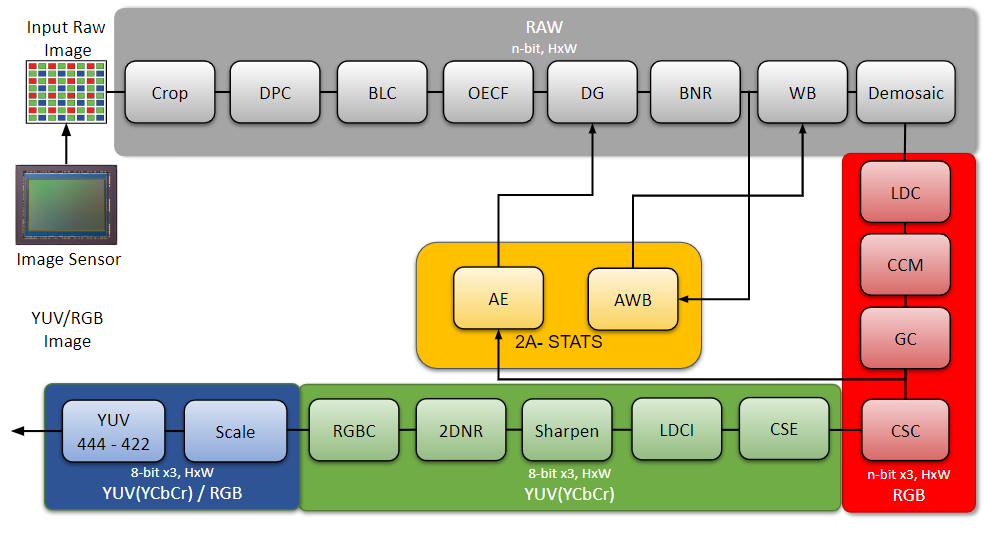
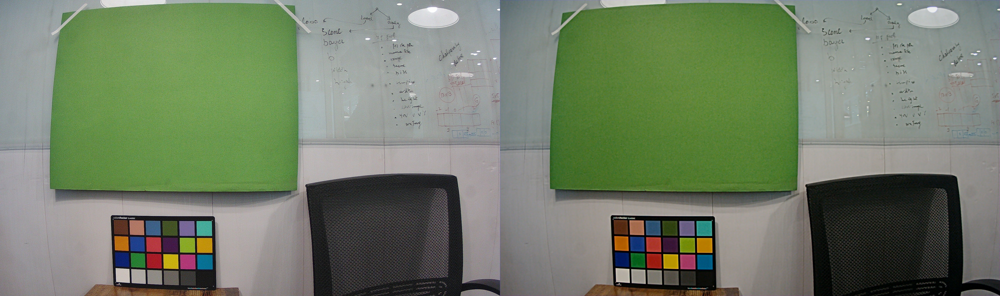
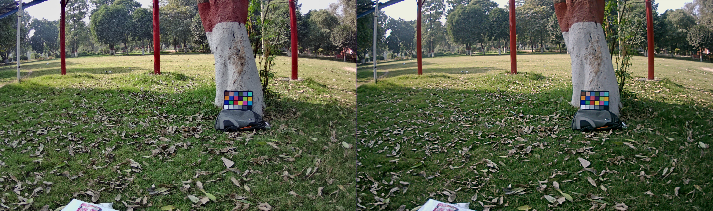
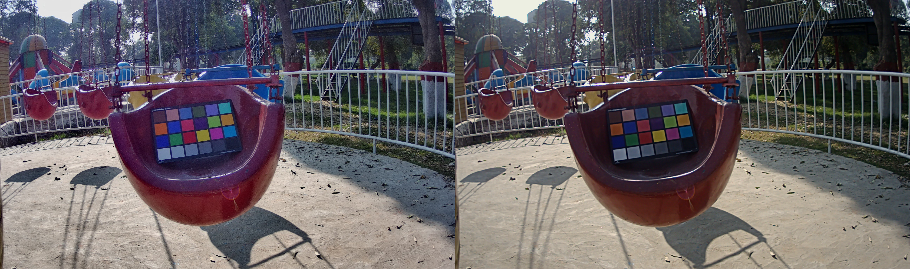
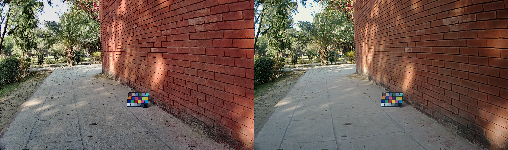
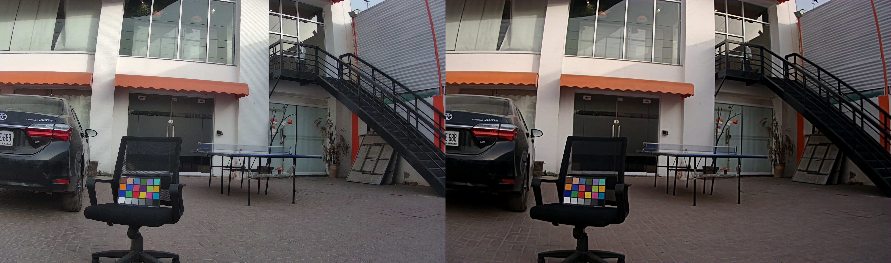
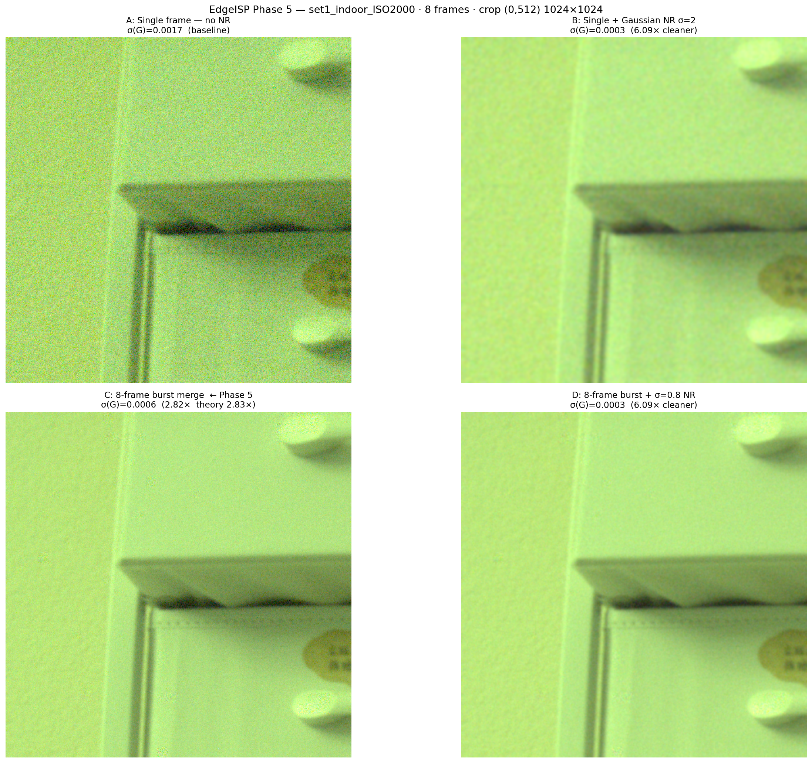
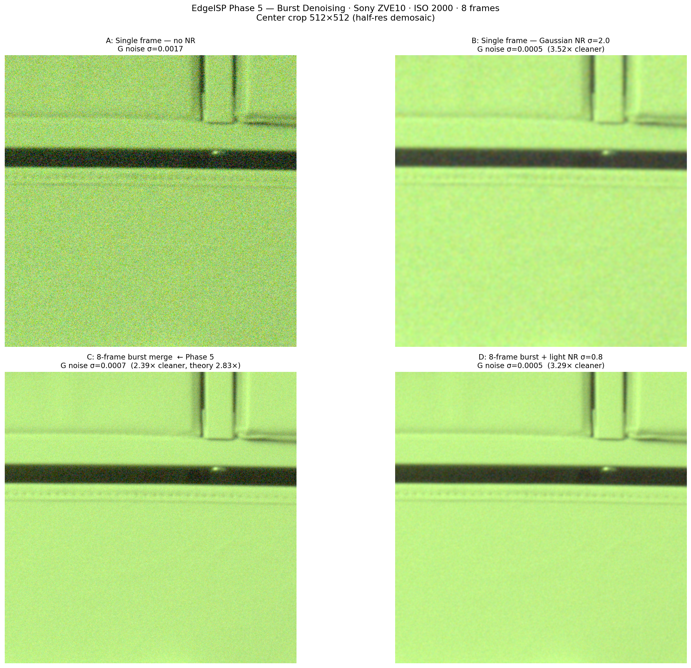
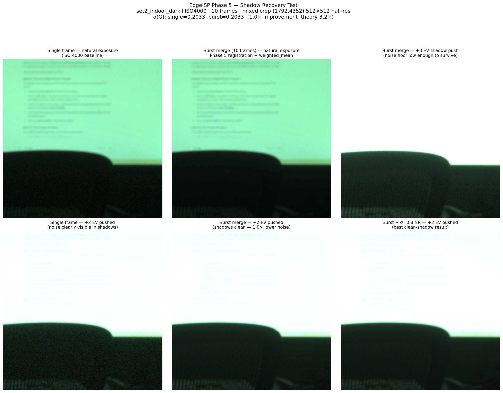

<p align="center">
  
</p>

<h1 align="center">Omni-ISP</h1>

<p align="center">
  <strong>A production-grade open-source ISP pipeline for wearable and embedded cameras</strong>
</p>

<p align="center">
  <a href="LICENSE"></a>
  <a href="https://www.python.org/"></a>
  <a href="tests/"></a>
  <a href="#modules"></a>
  <a href="#hdr-pipeline"></a>
  <a href="#deep-learning-inference"></a>
</p>

<p align="center">
  Built on <a href="https://github.com/10x-Engineers/Infinite-ISP">Infinite-ISP</a> by 10xEngineers — with major algorithmic upgrades, corrected pipeline ordering, multi-frame denoising, unified lens correction, deep learning inference, and a full HDR pipeline.
</p>

---

## Demo Gallery

<table>
  <tr>
    <td align="center"><strong>Indoor Scene</strong></td>
    <td align="center"><strong>Outdoor Scene 1</strong></td>
  </tr>
  <tr>
    <td></td>
    <td></td>
  </tr>
  <tr>
    <td align="center"><strong>Outdoor Scene 2</strong></td>
    <td align="center"><strong>Outdoor Scene 3</strong></td>
  </tr>
  <tr>
    <td></td>
    <td></td>
  </tr>
  <tr>
    <td align="center" colspan="2"><strong>Outdoor Scene 4</strong></td>
  </tr>
  <tr>
    <td align="center" colspan="2"></td>
  </tr>
</table>

<p align="center"><em>Raw Bayer sensor data &rarr; display-ready images, processed entirely by Omni-ISP</em></p>

### Low-Light Burst Denoising

<table>
  <tr>
    <td align="center" colspan="2"><strong>ISO 2000 &mdash; 8-Frame Burst Denoising</strong></td>
  </tr>
  <tr>
    <td align="center" colspan="2"></td>
  </tr>
  <tr>
    <td align="center" colspan="2"><em>Top-left: single frame (noisy) &rarr; Top-right: Gaussian NR (over-smoothed) &rarr; Bottom-left: 8-frame burst merge (2.82&times; cleaner, near-theoretical 2.83&times;) &rarr; Bottom-right: burst + light NR (6&times; cleaner, sharp edges preserved)</em></td>
  </tr>
</table>

<table>
  <tr>
    <td align="center" colspan="2"><strong>ISO 2000 &mdash; Center Crop Detail</strong></td>
  </tr>
  <tr>
    <td align="center" colspan="2"></td>
  </tr>
  <tr>
    <td align="center" colspan="2"><em>Same burst denoising pipeline at 512&times;512 center crop &mdash; noise texture vanishes while fine detail is retained</em></td>
  </tr>
</table>

<table>
  <tr>
    <td align="center" colspan="2"><strong>ISO 4000 Dark Scene &mdash; Shadow Recovery</strong></td>
  </tr>
  <tr>
    <td align="center" colspan="2"></td>
  </tr>
  <tr>
    <td align="center" colspan="2"><em>Top row: natural exposure (single vs. 10-frame burst vs. +1 EV push). Bottom row: +2 EV shadow push &mdash; single frame drowns in noise, burst merge stays clean, burst + NR delivers the best shadow detail.</em></td>
  </tr>
</table>

---

## What is Omni-ISP?

Omni-ISP converts **raw Bayer sensor data** into display-ready images. It targets the hardest end of the ISP design space: **small-aperture wearable cameras** where apertures are fixed, compute is constrained, noise is high, and optical imperfections can't be compensated with a bigger lens.

<table>
  <tr>
    <td width="33%" align="center">
      <h3>Correct Pipeline</h3>
      <p>Linear processing before gamma. NR before sharpening. BLC split around OECF. Correctness fixes that compound across the full pipeline.</p>
    </td>
    <td width="33%" align="center">
      <h3>Quality Modes</h3>
      <p>Every module has a fast baseline (real-time embedded) and an opt-in high-quality mode (offline/research). Defaults are always backward-compatible.</p>
    </td>
    <td width="33%" align="center">
      <h3>Wearable-First</h3>
      <p>Multi-frame burst denoising, unified lens correction, DL denoising, and a full HDR path address the specific failure modes of small sensors.</p>
    </td>
  </tr>
</table>

---

## Quick Start

```bash
# Clone the repository
git clone https://github.com/your-org/Omni-ISP.git
cd Omni-ISP

# Install dependencies
pip install -r requirements.txt

# Run on the included ColorChecker sample
python isp_pipeline.py
```

Output is saved to `out_frames/`. All pipeline parameters live in a single config file: `config/configs.yml`.

---

## Pipeline Architecture

```
                              ┌─────────────────────────────────────────────┐
                              │              RAW BAYER INPUT                │
                              └──────────────────┬──────────────────────────┘
                                                 │
                    ┌────────────────────────────────────────────────────────┐
                    │  SENSOR FRONT-END                                      │
                    │  Crop → DPC → BLC(offset) → OECF → BLC(lin) → DGain  │
                    │         ↑ adaptive MAD       ↑ correct domain split    │
                    └────────────────────────┬───────────────────────────────┘
                                             │
                    ┌────────────────────────────────────────────────────────┐
                    │  OPTICAL CORRECTION          [Phase 6]                 │
                    │  Unified CAC + LDC — single Bayer-domain warp          │
                    └────────────────────────┬───────────────────────────────┘
                                             │
                    ┌────────────────────────────────────────────────────────┐
                    │  BAYER PROCESSING                                      │
                    │  LSC → BNR → Burst Merge → TNR → 3A Stats             │
                    │                ↑ multi-frame     ↑ temporal IIR         │
                    └────────────────────────┬───────────────────────────────┘
                                             │
                    ┌────────────────────────────────────────────────────────┐
                    │  COLOR PIPELINE                                        │
                    │  AWB → WB → Demosaic → PF Removal → CCM → LDCI → 2DNR│
                    │             ↑ LMMSE HQ    ↑ Phase 6     ↑ guided LTM  │
                    └────────────────────────┬───────────────────────────────┘
                                             │
                    ┌────────────────────────────────────────────────────────┐
                    │  ENHANCEMENT & OUTPUT                                  │
                    │  DL Denoise → HDR TMO → Gamma → CSC → Sharp → Output  │
                    │  ↑ ONNX [P7]  ↑ 5 ops [P8]  ↑ multi-EOTF  ↑ adaptive │
                    └────────────────────────────────────────────────────────┘
```

---

## Feature Highlights

### Unified Lens Correction — One Warp, No Quality Loss

Chromatic Aberration Correction (CAC) and Lens Distortion Correction (LDC) are composed analytically into a **single per-channel warp field in the Bayer domain**, applied before demosaicing:

```
for each sub-channel (R, Gr, Gb, B):
    (xs, ys) = Brown-Conrady LDC undistortion
    (xs, ys) += per-channel CA differential radial scale
    output[y, x] = bilinear(input, ys, xs)
```

> One bilinear resample per channel instead of two. No cascaded interpolation artifacts. The demosaicker always receives a geometrically and chromatically correct Bayer image.

---

### Burst Denoising — Validated on Real Hardware

Tested on Sony ZVE10 (24 MP, ISO 2000–4000, 8–10 frame bursts):

| Mode | Noise | Gain |
|:---|:---:|:---:|
| Single frame, no NR | 0.00169 | 1.00x |
| Single frame + spatial NR | 0.00048 | 3.5x |
| **8-frame burst merge** | **0.00060** | **2.82x** |
| Burst + light spatial NR | 0.00028 | 6.0x |

> Theoretical maximum for 8 frames: sqrt(8) = **2.83x**. Measured: **2.82x** — within 0.4% of the theoretical limit.

Phase-correlation registration with sub-pixel parabolic refinement, per-block SAD motion detection, and weighted temporal merge (static: mean of N frames; moving: reference only).

---

### Deep Learning Inference

A full **ONNX-based inference layer** that slots into the pipeline without breaking the classical path:

```yaml
dl_denoise:
  is_enable: true
  mode: "rgb_post"                    # Post-demosaic ONNX inference
  model_path: "models/nafnet.onnx"    # Any ONNX denoiser
  tile_size: 256                      # Tiled inference for any resolution
  tile_overlap: 32                    # Seamless tile stitching
  fallback_classical: true            # Graceful fallback if model absent
```

When DL denoising is active, 2D NR automatically switches to chroma-only mode — the DL model handles luma, classical NR handles chroma. If the model is missing, the pipeline continues with classical processing. No crash, no silent corruption.

---

### HDR Pipeline

Five tone mapping operators and two multi-exposure merge algorithms:

| Operator | Style | Best For |
|:---|:---|:---|
| Reinhard | Natural, smooth | General purpose |
| Reinhard Extended | White-point controlled | Preventing washed highlights |
| **ACES** | **Cinematic S-curve** | **Film-quality rendering** |
| Hable / Uncharted 2 | Strong shadow lift | Film emulation |
| HLG Rolloff | Scene-referred | Broadcast HDR |

Multi-exposure merge with **Mertens** (exposure fusion, SDR output) or **Debevec** (true HDR radiance recovery). Physical luminance mapping via ISO 12232 calibration.

---

### Output Profiles

Named profiles bundle CCM primaries and gamma EOTF — no more mismatched color spaces:

```yaml
output:
  profile: "hdr10"    # srgb | rec709 | display_p3 | hdr10 | hlg | linear
  dither: "blue_noise"
```

| Profile | Color Space | EOTF | Use Case |
|:---|:---|:---|:---|
| `srgb` | sRGB | sRGB gamma | Web, general display |
| `rec709` | BT.709 | BT.1886 | Video production |
| `display_p3` | Display P3 | sRGB gamma | Apple devices, wide gamut |
| `hdr10` | BT.2020 | PQ (ST 2084) | HDR displays |
| `hlg` | BT.2020 | HLG (ARIB STD-B67) | Broadcast HDR |
| `linear` | sRGB | None | Compositing, scientific |

---

## Key Improvements over Infinite-ISP

| Area | Infinite-ISP | Omni-ISP |
|:---|:---|:---|
| Pipeline order | Gamma before LDCI/NR | Corrected linear-domain ordering |
| BLC + OECF | Single BLC block | Split: offset &rarr; OECF &rarr; linearise |
| DPC | Fixed threshold | MAD-based adaptive (scene-aware) |
| Demosaic | MHC only | + LMMSE high-quality mode |
| LDCI | CLAHE with tiles | + Guided filter LTM (edge-aware) |
| Sharpen | Uniform USM | + Edge-adaptive gain |
| 2D NR | Single NLM | + Bilateral, chroma-only |
| CCM | Camera &rarr; sRGB | XYZ intermediate &rarr; any gamut |
| Gamma | LUT only | Analytical sRGB / Rec.709 / PQ / HLG |
| Output | PNG only | + JPEG, YUV 4:4:4 / 4:2:2 / 4:2:0 |
| Dithering | None | Blue noise spatial dithering |
| Lens correction | None | Unified CAC + LDC single warp |
| Purple fringe | None | HSV hue-band + highlight proximity |
| Burst denoise | None | Phase-correlation multi-frame merge |
| Temporal NR | None | IIR temporal filter |
| AE | Histogram only | + Zone metering, PID, highlight protect |
| AWB | Gray World | + Gray Edge |
| AF | None | Contrast-detect (Tenengrad + Laplacian) |
| DL inference | None | ONNX tiled inference with fallback |
| HDR | None | 5 TMOs + 2 merge algorithms |

---

## Enabling Features

All new features are off by default. Enable them in `config/configs.yml`:

<details>
<summary><strong>High-quality demosaic (LMMSE)</strong></summary>

```yaml
demosaic:
  is_enable: true
  demosaic_method: "lmmse"    # default: "mhc"
```
</details>

<details>
<summary><strong>Guided filter LDCI</strong></summary>

```yaml
ldci:
  is_enable: true
  mode: "guided_filter"       # default: "clahe"
```
</details>

<details>
<summary><strong>Edge-adaptive sharpening</strong></summary>

```yaml
sharpen:
  is_enable: true
  mode: "adaptive"            # default: "usm"
  gain: 1.5
  noise_floor: 0.02
  edge_max: 0.15
```
</details>

<details>
<summary><strong>Burst denoising</strong></summary>

```yaml
burst_capture:
  is_enable: true
  n_frames: 8
  registration: "phase"
  merge_method: "weighted_mean"
```
</details>

<details>
<summary><strong>Lens correction (CAC + LDC)</strong></summary>

```yaml
lens_correction:
  is_enable: true
  ldc_enable: true
  k1: -0.12
  k2: 0.04
  cac_enable: true
  r_ca: [0.0008, 0.0, 0.0]
  b_ca: [-0.0010, 0.0, 0.0]
```
</details>

<details>
<summary><strong>DL denoising (ONNX)</strong></summary>

```yaml
dl_denoise:
  is_enable: true
  mode: "rgb_post"
  model_path: "models/nafnet_sidd_width32.onnx"
  tile_size: 256
  tile_overlap: 32
  batch_size: 4
  fallback_classical: true
```
</details>

<details>
<summary><strong>HDR tone mapping + merge</strong></summary>

```yaml
hdr_tone_mapping:
  is_enable: true
  mode: "aces"                # reinhard | reinhard_ext | aces | hable | highlight_rolloff
  peak_nits: 1000.0
  key: 0.18

output:
  profile: "hdr10"
  dither: "blue_noise"
```
</details>

---

## Project Structure

<a id="modules"></a>

```
omni_isp.py                       Main pipeline class
isp_pipeline.py                   CLI entry point (single image)
isp_pipeline_mulitple_images.py   Batch / video processing
config/configs.yml                All parameters — single source of truth

modules/
  ├── auto_exposure/              Zone metering + PID controller
  ├── auto_focus/                 Contrast-detect AF
  ├── auto_white_balance/         Gray World + Gray Edge
  ├── bayer_noise_reduction/      Joint bilateral filtering
  ├── black_level_correction/     OB pixel estimation, FPN correction
  ├── burst_capture/              Stack loader + registration + merge
  ├── color_correction_matrix/    Direct + XYZ intermediate
  ├── color_space_conversion/     RGB ↔ YCbCr conversion
  ├── crop/                       ROI extraction
  ├── dead_pixel_correction/      MAD adaptive threshold
  ├── demosaic/                   MHC + LMMSE
  ├── digital_gain/               Linear gain stage
  ├── dl_denoise/                 ONNX tiled inference
  ├── gamma_correction/           LUT + analytical EOTFs
  ├── hdr_merge/                  Mertens + Debevec
  ├── hdr_tone_mapping/           5 tone mapping operators
  ├── ldci/                       CLAHE + guided filter LTM
  ├── lens_correction/            Unified CAC + LDC warp
  ├── lens_shading_correction/    Vignetting compensation
  ├── noise_reduction_2d/         NLM + bilateral + chroma-only
  ├── oecf/                       Sensor response linearization
  ├── purple_fringe_removal/      Hue-selective desaturation
  ├── rgb_conversion/             Bit-depth conversion
  ├── scale/                      Bilinear + nearest neighbor
  ├── sharpen/                    USM + edge-adaptive
  ├── temporal_nr/                IIR temporal filter
  ├── white_balance/              Gain application
  └── yuv_conv_format/            4:4:4 / 4:2:2 / 4:2:0

util/
  ├── output_profile.py           Named output profiles
  ├── dither.py                   Blue noise dithering
  └── bayer_utils.py              Bayer pattern helpers

tests/                            419 tests across 10 suites
```

---

## Test Suite

```bash
python tests/test_phase1.py             # Pipeline correctness        (27 tests)
python tests/test_phase2.py             # Module algorithm upgrades   (24 tests)
python tests/test_phase3.py             # Output system               (46 tests)
python tests/test_phase4.py             # BLC / 2D NR / YUV          (38 tests)
python tests/test_phase5.py             # CCM / gamma / profiles      (45 tests)
python tests/test_3a.py                 # 3A algorithms               (60 tests)
python tests/test_phase6.py             # Burst + TNR pipeline        (43 tests)
python tests/test_lens_correction.py    # Lens correction             (39 tests)
python tests/test_phase7.py             # DL inference                (42 tests)
python tests/test_phase8.py             # HDR tone mapping + merge    (55 tests)
```

---

## Roadmap

| Phase | Status | Description |
|:---|:---:|:---|
| 1 — Pipeline correctness | :white_check_mark: | Ordering fixes, BLC/OECF domain split |
| 2 — Module upgrades | :white_check_mark: | LMMSE, guided LDCI, adaptive sharpen, vibrance |
| 3 — Output system | :white_check_mark: | XYZ CCM, multi-EOTF gamma, output profiles, dither |
| 4 — 3A algorithms | :white_check_mark: | Zone AE, Gray Edge AWB, contrast-detect AF |
| 5 — Multi-frame | :white_check_mark: | Burst denoising, phase-correlation, TNR |
| 6 — Lens corrections | :white_check_mark: | Unified CAC + LDC, purple fringe removal |
| 7 — DL integration | :white_check_mark: | ONNX inference, tiled DL-A, graceful fallback |
| 8 — HDR pipeline | :white_check_mark: | 5 TMOs, Mertens + Debevec merge, ISO 12232 |
| 9 — DL-B joint model | :soon: | Joint Bayer &rarr; RGB model (BNR + Demosaic + NR) |

---

## Documentation

- **[Module Guide](docs/module_guide.md)** — algorithm walkthrough, config reference, and tuning notes
- **[Progress](PROGRESS.md)** — phased roadmap with detailed implementation notes
- **[Contributing](docs/CONTRIBUTIONS.md)** — how to contribute

---

## License

Licensed under the [Apache License 2.0](LICENSE).

Built on [Infinite-ISP](https://github.com/10x-Engineers/Infinite-ISP) — Copyright 2024, 10xEngineers. See [NOTICE](NOTICE) for upstream attribution.
